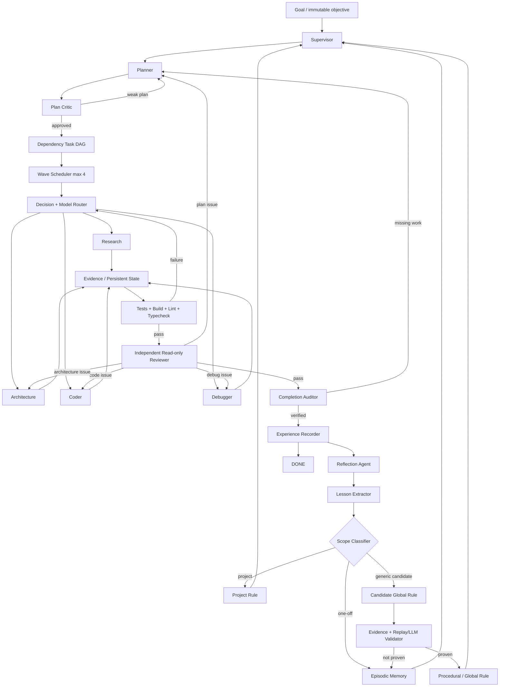

# Architecture

## Runtime boundaries

- Parent Pi session: commands, UI/status, persisted orchestration.
- Child Pi workers: isolated `pi --mode json -p --no-session` processes with role-specific tools/prompts/models.
- Child context handler: reversible pruning of oversized tool results only.
- Disk state: source of truth for goal, task, evidence, and memory state.

## Model policy

- Super: default planning, coding, research, review, normal repairs.
- Ultra: high-risk architecture, repeated failure, difficult/invalid structured outputs, severe review findings, ambiguous completion audit, global-rule validation when needed.
- Laya slot: fast control-plane decisions in a future provider; never sole completion judge.
