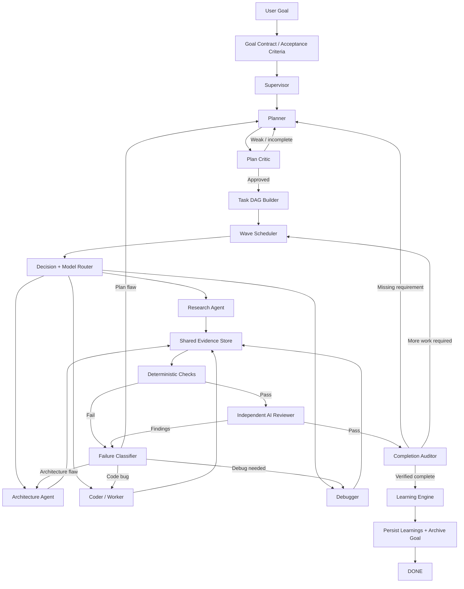
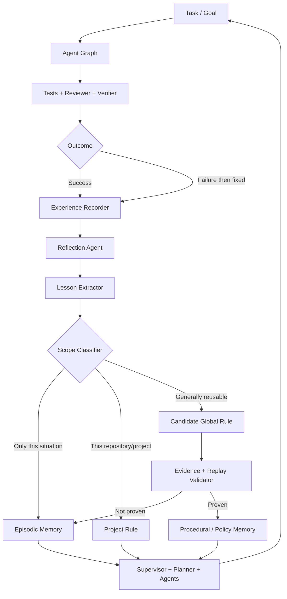

# Pi Goal Graph — Master Architecture & Research Record

**Date:** 2026-09-27  
**Purpose:** Source-of-truth reconstruction of the Pi Coding Agent plugin design after reviewing the full discussion and refreshing the external research.  
**Next rebuild version:** `v0.4.0` (recommended, to avoid confusing it with earlier `v0.1`, `v0.2`, and the partially recovered `v0.3.0-final`).

---

## 1. Core requirement

Build a **Pi Coding Agent extension/plugin** that accepts a high-level goal and autonomously drives it to a **verified completion state** using a **graph of isolated sub-agents**, not a dumb `while (!done)` loop.

The system should:

- break a goal into tasks and dependencies;
- plan and critique the plan before implementation;
- run independent tasks in parallel where safe;
- choose between exactly two primary LLMs: **NVIDIA Nemotron 3 Super 120B-A12B** and **NVIDIA Nemotron 3 Ultra 550B-A55B**;
- keep the default path fast/cheap by preferring Super and escalating to Ultra only when justified;
- provide a placeholder for a fast decision model such as **Laya**, without making Laya a hard dependency;
- maintain context aggressively so long-running work does not degrade from tool-output bloat;
- independently review and verify work rather than trusting the coder's own claim of completion;
- persist goal/task/evidence state outside the model context so work survives context resets and sessions;
- learn from successful and failed runs, separating one-off memories, project rules, and candidate reusable rules;
- remain lightweight and Pi-native; avoid unnecessary graph frameworks, vector DBs, Graphify, or SaaS dependencies by default.

---

## 2. What this is NOT

This is **not**:

- a simple infinite Ralph loop;
- a LangGraph dependency unless later proven necessary;
- a single agent role-playing several personas in one context;
- a system that considers `"DONE"` from an LLM sufficient evidence;
- a plugin that silently installs third-party tools;
- a system that lets a single failed/successful experience become a global rule;
- a Graphify-style full code knowledge graph by default.

Ralph-style systems are used as **design references** for persistence, fresh contexts, verification, recovery, and completion discipline — not as the runtime architecture.

---

## 3. Reconstructed history

### v0.1.0

Previously built as `pi-goal-graph-v0.1.0.zip`.

Confirmed features included:

- graph-oriented agents: planner, plan reviewer, researcher/architect/coder, debugger, reviewer, verifier/auditor;
- Super/Ultra routing;
- Laya decision-engine placeholder;
- isolated subagent execution;
- context compaction / persistent logs;
- project and candidate-global learning rules;
- `/goal`, `/goal-status`, `/goal-config` commands;
- read-only AI review + repository checks;
- syntax checks + **5/5 tests passed**;
- no real Pi end-to-end load test at that time because `pi` was unavailable in the build environment.

### v0.2.0

Previously built as `pi-goal-graph-v0.2.0.zip`.

Added:

- **OCR = OpenCode Review delegation** (not optical character recognition);
- generic external-tool registry;
- approval-before-install / approval-before-use behavior;
- conditional Semgrep integration;
- conditional OSV-Scanner integration;
- `/goal-tools`;
- syntax checks + **8/8 tests passed**.

Known issue after v0.2: dependency-ready tasks were still executed sequentially.

### v0.3.0-final

The recovered conversation record confirms that a later `v0.3.0-final` existed and added **dependency-wave parallel isolated agents with max concurrency 4**. The surviving retrieval record is truncated, so this master specification does **not** invent any additional v0.3 details that cannot be recovered confidently.

Therefore, the next clean rebuild should be versioned **v0.4.0** and generated from this document as the source of truth.

---

## 4. Final graph architecture



The graph is **cyclic**, but cycles are semantic graph edges with explicit reasons and state transitions. This is deliberately different from blindly re-prompting a model in a loop.

---

## 5. Agent roles

### Supervisor

Owns graph state, not coding. It selects the next graph transition, tracks blockers, and enforces completion contracts.

### Planner

Creates a dependency-aware implementation plan with acceptance criteria and verification requirements.

### Plan Critic

Read-only. Attempts to break the plan: missing dependencies, unsafe assumptions, untestable requirements, missing migration/docs/security implications.

### Research Agent

Read-only by default. Finds relevant code, docs, APIs, conventions, and returns compressed evidence rather than dumping raw files into the parent context.

### Architecture Agent

Used only when the task materially changes architecture/contracts or when repeated implementation failure suggests a design problem.

### Coder / Worker

Implements one scoped task at a time. Gets only the goal contract, current task, relevant project rules, and retrieved evidence — not the entire historical transcript.

### Debugger

Activated by failing tests/build/runtime evidence. Works from the failing evidence and minimal related code.

### Independent Reviewer

Runs in a fresh isolated context and is **not** the coder. Read-only. Reviews correctness, regressions, security, testing gaps, maintainability, and requirement alignment.

### Completion Auditor

Checks the original goal and every acceptance criterion against a proof ledger. It cannot mark the goal complete merely because another agent says it is complete.

### Reflection / Learning Agent

Runs after successful completion or after a failure was successfully fixed. Extracts useful lessons without modifying model weights.

---

## 6. Parallel task execution

Use the task DAG to compute a **ready wave**:

```text
ready = incomplete tasks whose dependencies are all complete
```

Independent ready tasks may run concurrently in isolated Pi subagents.

**Default concurrency: 4**.

Why 4:

- Pi's current subagent example already demonstrates parallel isolated subagents and uses a max concurrency of 4;
- it gives useful parallelism without flooding APIs, terminals, or shared repository state;
- it can remain configurable.

Tasks that edit overlapping files or depend on shared mutable state should not run concurrently unless the planner explicitly proves they are independent.

---

## 7. Primary model router: only Super and Ultra

### Models

1. **NVIDIA Nemotron 3 Super 120B-A12B** — default workhorse.
2. **NVIDIA Nemotron 3 Ultra 550B-A55B** — escalation model.

NVIDIA currently positions Super for agentic workflows, high-volume work, tool use, RAG, and long context; Ultra is positioned for frontier reasoning, complex agentic workflows, and high-accuracy long-context/tool work.

### Default routing

Use **Super** for:

- repository scouting;
- normal planning;
- routine implementation;
- normal debugging;
- summarization/context condensation;
- ordinary review;
- experience reflection.

Escalate to **Ultra** when one or more of these are true:

- plan critic and planner disagree after a repair;
- architectural / cross-system changes are required;
- the same failure pattern persists after multiple materially different attempts;
- a high-severity security/correctness issue is under dispute;
- requirements are contradictory or underspecified and the decision materially changes the solution;
- final audit has ambiguous evidence;
- a candidate **global** rule is being considered for promotion and the evidence is conflicting.

The router must log **why** Ultra was selected.

---

## 8. Fast Decision Engine placeholder (Laya-ready)

Do **not** hard-wire Jev. Jev is removed.

Expose a provider interface:

```text
DecisionEngine
├── None / HeuristicProvider   <- default, zero dependency
├── HuggingFaceLayaProvider    <- placeholder / optional
└── LocalLayaProvider          <- placeholder / optional
```

Laya is well suited to small typed decisions because it is a non-generative System-1 classifier/decision model returning choice/score/yes-no probabilities.

Good uses:

- Super vs Ultra?
- Which specialist role should run next?
- Is this failure code / test / environment / plan / architecture?
- Is a lesson episodic / project-specific / candidate-global?
- Is a context item keep / summarize / archive / discard-from-active-context?
- Is confidence low enough to escalate to a generative model?

Important refinement: **do not feed the entire long conversation to Laya**. Its decision checkpoints are intended for compact state descriptions. Feed structured metadata/snippets per decision. High-impact or low-confidence decisions escalate to Super/Ultra.

The plugin must work fully when Laya is not configured.

---

## 9. Context engine

### Important correction

There is **no proven universal rule** that a model is "smart only below 40% context". Long-context research shows position and irrelevant-context effects, but not a magic percentage.

We can still use the user's desired operational policy:

```text
soft target:        ~40% active context
prune trigger:      ~50-55%
hard intervention:  ~65-70%
```

These are configurable engineering thresholds, not scientific constants.

### Design: hot/cold reversible context

Borrow the good idea demonstrated by `pi-context-prune` / `pi-condense`:

```text
raw tool result
      ↓
short high-value summary in active context (HOT)
      +
original output stored outside active prompt (COLD)
      ↓
retrievable later by stable reference id
```

Do not delete source evidence from disk. Only remove it from the next model prompt.

### Always pin in active context

- user objective;
- acceptance criteria;
- current task;
- unresolved blocker/latest error;
- current plan/task DAG summary;
- relevant project rules;
- evidence needed for the current decision.

### Good prune/archive candidates

- old successful test logs;
- verbose tool outputs already consumed;
- repeated directory listings;
- full files after a concise relevant excerpt is recorded;
- stale progress chatter;
- duplicate search results;
- resolved error traces;
- old subagent transcripts after their findings are distilled.

### Context retrieval

Every archived item receives a stable ID. Agents can request the original if the summary is insufficient.

### Pi-native integration

Pi already has session compaction and extension hooks that can modify request context. The plugin should use those hooks rather than building a second chat runtime.

---

## 10. Why Graphify is NOT default

Do not include a full code knowledge graph / Graphify dependency in the default plugin.

Reasons:

- modern coding models are already strong at targeted repository search;
- graph construction creates indexing cost and staleness problems;
- isolated scout agents + cached evidence + task-scoped file retrieval solve most of the real problem;
- the user explicitly wants to avoid overkill.

Leave a future optional interface such as `CodeMapProvider`, but ship it disabled/unimplemented in the core plugin.

---

## 11. Verification and code review

The coder does not decide whether its own work is correct.

### Layer 1 — deterministic project checks

Auto-detect where possible:

- tests;
- build/compile;
- lint;
- typecheck;
- formatting check;
- project-specific verification command.

A canonical project verification command should be saved into project memory after discovery.

### Layer 2 — local/static tools

Optional and approval-gated:

- **Semgrep Community Edition** for local static analysis;
- **OSV-Scanner** for dependency vulnerability checks;
- project-native linters/analyzers.

Important: `reviewdog` is useful as a **diagnostic aggregator/filter**, but it is not itself a code analyzer. Therefore it must never be treated as the core reviewer. It can optionally normalize/filter linter output by diff.

### Layer 3 — independent AI reviewer

Fresh context, read-only tools, preferably Super by default with Ultra escalation for difficult findings.

### Layer 4 — optional external review adapter

**OCR = OpenCode Review** can be invoked only when:

- OpenCode is already available or the user explicitly approves setup;
- the tool registry allows it;
- privacy/network behavior has been surfaced;
- it adds value beyond the built-in independent reviewer.

Do not require CodeRabbit. It may be an optional future adapter only.

### Layer 5 — completion auditor

The completion auditor sees:

- immutable objective;
- acceptance criteria;
- task status;
- evidence ledger;
- relevant diff/files;
- deterministic check results;
- reviewer findings and their resolution.

Only the auditor can move the goal to `COMPLETED`.

---

## 12. Proof ledger / completion semantics

Each acceptance criterion gets a record:

```json
{
  "criterion": "All authentication tests pass",
  "status": "verified",
  "evidence": [
    {
      "type": "command",
      "command": "npm test -- auth",
      "exitCode": 0,
      "artifactRef": "ev_042"
    }
  ]
}
```

Completion requires:

```text
all required tasks complete
AND all acceptance criteria verified
AND deterministic required checks pass
AND reviewer has no unresolved blocking findings
AND completion auditor returns PASS
```

An LLM phrase such as `DONE`, `LGTM`, or `<promise>COMPLETE</promise>` is never sufficient on its own.

---

## 13. Avoiding stupid infinite loops

The plugin should continue autonomously, but not repeat the same failed action forever.

Use **progress-aware circuit breaking**:

1. detect repeated equivalent failure signatures;
2. require a materially different strategy before another retry;
3. escalate model/role when retries stop adding evidence;
4. re-plan when the failure is structural;
5. mark `BLOCKED` only when external/user input is genuinely required or all distinct strategies have been exhausted.

`BLOCKED` is not `DONE`.

No arbitrary low global iteration limit should stop healthy progress. Limits should be safety/budget settings, configurable by the user.

---

## 14. Self-improving Learning Engine

No model-weight training is required. Improvement comes from structured experience memory and validated reusable rules.

User-specified core flow:



### Memory classes

#### Episodic memory

One-off experience, e.g.:

> Build failed because an external service was unavailable.

Useful for similar situations but not forced globally.

#### Project rule

Repo-specific stable fact, e.g.:

> This repository uses pnpm and Vitest. Use `pnpm test`.

Project rules may be promoted quickly when backed by deterministic repository evidence.

#### Candidate global rule

Reusable behavioral lesson, e.g.:

> Before running JS package commands, inspect the lockfile/packageManager field.

A candidate is **not active globally yet**.

#### Active global/procedural rule

Only after sufficient evidence.

### Rule metadata

```text
id
rule
scope
status: candidate | active | deprecated
confidence
evidence_count
successful_uses
failed_uses
projects_seen
created_at
last_used
contradictions
source_episode_ids
```

### Promotion policy

Do not promote a global rule from one event.

Recommended default:

- at least 3 supporting uses;
- at least 2 distinct task contexts;
- preferably evidence from 2 projects for a truly global rule;
- no unresolved contradiction;
- reviewer/validator approval.

Allow manual override.

### Demotion

If an active rule causes failures or accumulates contradictions, decrease confidence and move it back to candidate/deprecated instead of blindly preserving it forever.

### Learn from successes too

Record:

```text
decision
state/features
selected model/agent
outcome
retries
tokens/tool calls when available
checks result
review result
```

This lets routing improve from both failures and successful low-cost paths.

### Research basis

This design matches the broad principles of:

- Reflexion: textual reflection stored as episodic memory;
- Voyager: reusable skill/behavior library + self-verification;
- Ralph-style systems: persist state in files/tests rather than retaining the whole past in model context.

---

## 15. Persistence layout

Suggested lightweight file structure:

```text
.pi/goal-graph/
├── config.json
├── tools.json
├── goals/
│   └── <goal-id>/
│       ├── goal.json
│       ├── tasks.json
│       ├── events.jsonl
│       ├── evidence.jsonl
│       ├── summaries.jsonl
│       └── archive/
├── memory/
│   ├── episodes.jsonl
│   ├── project-rules.json
│   └── candidate-rules.json
└── runs/
    └── <run-id>.jsonl

~/.pi/agent/goal-graph/
└── global-rules.json
```

No vector database in the default build. Start with structured JSON/JSONL + tags/keywords. Add embeddings only if real usage proves lexical/structured retrieval inadequate.

---

## 16. External tool approval registry

No silent installation.

Example record:

```json
{
  "semgrep": {
    "status": "approved",
    "executable": "semgrep",
    "network": "local scan by default",
    "scope": "project"
  },
  "osv-scanner": {
    "status": "approved",
    "executable": "osv-scanner",
    "network": "dependency metadata may be queried unless offline mode is used",
    "scope": "project"
  },
  "opencode-review": {
    "status": "disabled",
    "scope": "project"
  }
}
```

The plugin can detect availability, but installation or enabling must remain explicit.

---

## 17. Safety / isolation rules

- project-local agent definitions are treated as repo-controlled code/instructions and should require trust;
- reviewer and auditor are read-only by default;
- worker gets write/edit/bash;
- destructive commands should pass Pi safety/confirmation hooks;
- goal objective is immutable during a run unless the user explicitly changes it;
- learned global policies must not silently rewrite the user's goal;
- external tool/network behavior must be visible.

---

## 18. Commands for v0.4.0 rebuild

Recommended minimal command surface:

```text
/goal <objective>            create/confirm goal
/goal-direct <objective>     start immediately when objective is already precise
/goal-status                 graph/task/evidence status
/goal-pause
/goal-resume
/goal-config                 routing/context/concurrency settings
/goal-tools                  external tool registry
/goal-memory                 inspect learned project/global rules
/goal-graph                  display current DAG and node states
```

Avoid command sprawl beyond this unless real usage demands it.

---

## 19. Suggested configuration

```json
{
  "models": {
    "default": "nvidia/nemotron-3-super-120b-a12b",
    "escalation": "nvidia/nemotron-3-ultra-550b-a55b"
  },
  "parallel": {
    "maxConcurrency": 4
  },
  "context": {
    "softTargetPct": 40,
    "pruneAtPct": 55,
    "hardCompactAtPct": 70,
    "reversibleArchive": true
  },
  "decisionEngine": {
    "provider": "none",
    "confidenceEscalationThreshold": 0.75
  },
  "review": {
    "independentAIReviewer": true,
    "semgrep": "if-approved-and-installed",
    "osvScanner": "if-approved-and-installed",
    "openCodeReview": "optional"
  },
  "learning": {
    "enabled": true,
    "globalPromotionMinEvidence": 3,
    "globalPromotionMinProjects": 2,
    "allowAutoDemotion": true
  }
}
```

---

## 20. Research findings that materially changed the design

### Pi already supports the right primitives

Pi's current examples demonstrate:

- extension lifecycle hooks;
- context modification/custom compaction;
- subagents in isolated Pi processes;
- parallel subagent execution;
- separate agent model/tool definitions.

Therefore this should remain a **Pi TypeScript extension**, not an external orchestration framework.

### `pi-goal-x` proves durable goals are practical inside Pi

It currently demonstrates persistent goals, auto-continuation, verification contracts, independent completion auditors, disk-backed state, and goal/task lifecycles. We should borrow the good lifecycle ideas but keep our graph/router/learning architecture distinct.

### Context pruning should be reversible

`pi-context-prune` / `pi-condense` validate the hot-summary/cold-original approach and expose a retrieval escape hatch. That is a better design than deleting old tool results.

### Ralph's strongest lesson is state outside context

Ralph variants repeatedly rely on PRDs/files/git/tests as durable state and fresh contexts per iteration/task. We should retain that idea while replacing the linear loop with a dependency graph and isolated roles.

### reviewdog is not enough by itself

It aggregates/filter diagnostics from actual analyzers. Therefore deterministic project checks + Semgrep/OSV/project linters + independent AI review are the real verification layers.

### Long context has no magic 40% cliff

Research such as *Lost in the Middle* shows that long contexts can degrade retrieval depending on where relevant information appears and how much irrelevant content is present. Thus keeping active context small and high-value is reasonable, but 40% is a tunable policy rather than a scientific threshold.

### Self-improvement should be memory/rule learning, not uncontrolled self-rewriting

Reflexion/Voyager-style experience retention supports improving behavior without retraining. Candidate-rule promotion/demotion prevents one bad run from poisoning the system.

---

## 21. Reference projects / research

- Pi Coding Agent / examples: `https://github.com/mariozechner/pi-coding-agent` (package name / canonical project lineage; current indexed mirrors also expose the extension examples)
- Pi subagent example: isolated contexts + parallel/chain execution
- `pi-goal-x`: `https://github.com/tmonk/pi-goal-x`
- `pi-context-prune`: `https://github.com/championswimmer/pi-context-prune`
- `pi-condense`: `https://github.com/jjuraszek/pi-condense`
- Ralph Wiggum: `https://github.com/wiggumdev/ralph`
- Minimal file-based Ralph: `https://github.com/iannuttall/ralph`
- Builder/reviewer Ralph harness: `https://github.com/sagar-aps/ralph-harness`
- reviewdog: `https://github.com/reviewdog/reviewdog`
- Semgrep: `https://github.com/semgrep/semgrep`
- OSV-Scanner: `https://github.com/google/osv-scanner`
- OpenCode Review multi-agent system: `https://github.com/yldgio/opencode-review`
- Proval self-hosted reviewer: `https://github.com/seoes/proval`
- Laya: `https://github.com/he-jev/laya`
- Laya Node/TS runtime: `https://github.com/receptron/laya`
- Laya public demo Space: `https://huggingface.co/spaces/convaiinnovations/laya-demo`
- Reflexion: `https://arxiv.org/abs/2303.11366`
- Voyager: `https://arxiv.org/abs/2305.16291`
- Lost in the Middle: `https://arxiv.org/abs/2307.03172`

---

## 22. Build priority for v0.4.0

Implement in this order:

1. persistent goal + task DAG schema;
2. supervisor + conditional graph transitions;
3. isolated subagent runner + dependency-wave parallelism (max 4);
4. deterministic Super/Ultra router;
5. proof ledger + tests/checks + independent reviewer + auditor;
6. reversible context manager;
7. learning engine with episodic/project/candidate-global memory;
8. external-tool registry + optional Semgrep/OSV/OCR adapters;
9. Laya provider interfaces/placeholders;
10. TUI/commands and final Pi end-to-end tests.

This order delivers the actual autonomy/quality benefits first and leaves optional intelligence layers until the core is reliable.

---

## 23. Definition of done for the plugin itself

The plugin rebuild is not complete until all of these are proven:

- Pi loads the extension successfully in a real Pi installation;
- `/goal-direct` can create and persist a goal;
- a task DAG can execute at least two independent tasks concurrently;
- Super/Ultra routing can be observed in logs;
- a failing check routes back to a repair node;
- reviewer is isolated/read-only;
- completion auditor rejects an intentionally incomplete task;
- context archive can restore an original pruned tool output;
- project memory survives a new Pi session;
- a generic lesson remains candidate after one example and can be promoted only after configured evidence;
- external tools are never silently installed;
- all unit/integration tests pass.

Only after that should a ZIP be called the new latest release.

